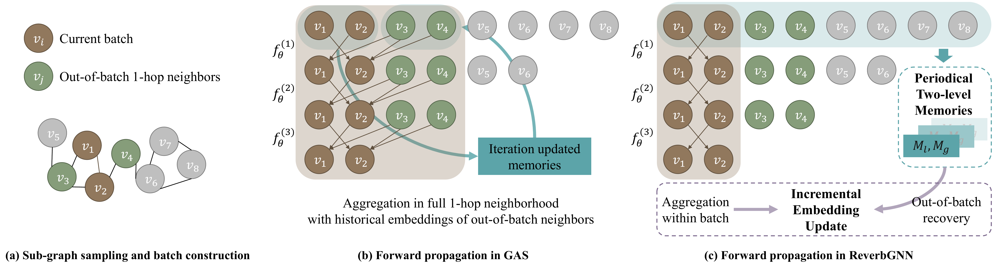

# ReverbGNN

This repository provides the codes and results for the paper: *ReverbGNN: Scaling Graph Training with Periodical Local and Global Memory*

<p float="left">
  
  <!--   -->
</p>


## Requirements

This project is built upon [Python 3.10](https://www.python.org).

PyG library is required for this project, please install according to your pytorch and CUDA version.
```
pip install torch-scatter -f https://pytorch-geometric.com/whl/torch-${TORCH}+${CUDA}.html
pip install torch-sparse -f https://pytorch-geometric.com/whl/torch-${TORCH}+${CUDA}.html
pip install torch-geometric
```

where `${TORCH}` should be replaced by either `1.7.0` or `1.8.0`, and `${CUDA}` should be replaced by either `cpu`, `cu92`, `cu101`, `cu102`, `cu110` or `cu111`, depending on your PyTorch installation.

Requirements can be installed and checked by running 'setup.py'.

It is recommended to create a new `conda` environment for this project as it may be tricky to install `PyG`, `torch-sparse`, and `torch-scatter` as it can mess up your current dependencies.

This project is based on GAS repo, https://github.com/rusty1s/pyg_autoscale.


## Reproducing Results

### Train the model
Here’s a general command template to train a model with ReverbGNN:
```bash
python main.py \
    ++model=pna \
    ++dataset=flickr \
    ++root=/tmp/datasets \
    ++device=0 \
    ++log_every=1
```

| Parameter   | Description                                             |
|-------------|---------------------------------------------------------|
| `model`     | Backbone GNN model (e.g., `pna`, `gcn`, `appnp`, `gcn2`，`graphsage`) |
| `dataset`   | Dataset name (e.g., `flickr`, `ogbn-arxiv`, `ogbn-products`, `reddit`, `amazon-products`) |
| `root`      | Directory path to download/cache datasets               |
| `device`    | GPU index                 |
| `log_every` | Frequency (in iterations) to log progress               |


## Experimental Results


| Method \ Dataset       | ARXIV       | PRODUCTS    |
|------------------------|-------------|-------------|
| GCN [22]               | 71.7 ± 0.3  | 75.6 ± 0.2  |
| GraphSAGE [18]         | 71.5 ± 0.3  | 78.3 ± 0.2  |
| GraphSAINT [35]        | 70.2 ± 0.2  | 79.1 ± 0.2  |
| Cluster-GCN [8]        | 65.3 ± 0.2  | 79.0 ± 0.3  |
| VR-GCN [5]             | 72.2 ± 0.1  | 69.9 ± 0.2  |
| NAGphormer [3]         | 70.1 ± 0.6  | 73.6 ± 0.2  |
| Exphormer [29]         | 72.4 ± 0.3  | -           |
| SGFormer [32]          | 72.6 ± 0.1  | 74.2 ± 0.3  |
|                        |             |             |
| **GAS Variants**       |             |             |
| GCN-GAS                | 71.5 ± 0.3  | 75.3 ± 0.2  |
| APPNP-GAS              | 71.1 ± 0.1  | 78.5 ± 0.2  |
| GCNII-GAS              | 72.8 ± 0.5  | 76.2 ± 0.5  |
|                        |             |             |
| **Reverb Variants (ours)** |         |             |
| GCN-Reverb             | 71.4 ± 0.5  | 75.6 ± 0.1  |
| APPNP-Reverb           | 70.8 ± 0.3  | 78.5 ± 0.2  |
| GCNII-Reverb           | 72.6 ± 0.5  | 75.9 ± 0.4  |


